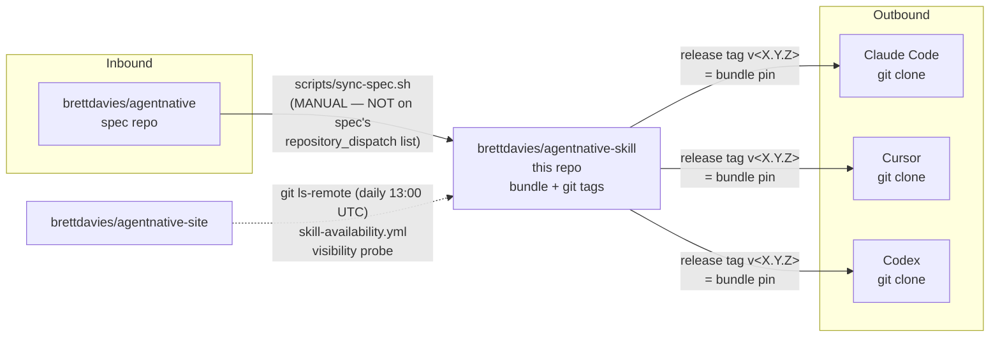
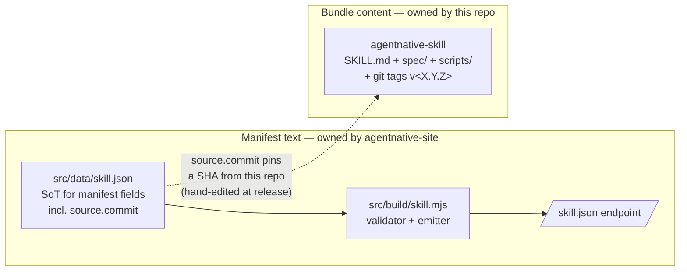

# Cross-repo sync map

How spec content flows in and how the skill bundle flows out. Source of truth for the sync mechanisms that connect this
repo to its three sibling repos (`agentnative` spec, `agentnative-site`, `agentnative-cli`) and to consumer agent hosts.

> This document is a routing map. Per-script details (env vars, fallback behavior, exit codes) live in the script
> headers. Re-vendor procedure during a release lives in [`RELEASES.md`](../RELEASES.md). Vendored-spec mechanics live
> in [`spec/README.md`](../spec/README.md).

## Upstream — data flowing INTO this repo

| Source                                                                                       | Mechanism                       | What's synced                                               | Trigger / cadence                                                                                                                                                                                                           | Drift check                                                                                                                                                                                                                                                                                 |
| -------------------------------------------------------------------------------------------- | ------------------------------- | ----------------------------------------------------------- | --------------------------------------------------------------------------------------------------------------------------------------------------------------------------------------------------------------------------- | ------------------------------------------------------------------------------------------------------------------------------------------------------------------------------------------------------------------------------------------------------------------------------------------- |
| `brettdavies/agentnative` (spec); default latest `v*` tag, or any branch/tag/SHA via `--ref` | `scripts/sync-spec.sh` (manual) | `principles/p*-*.md` + `VERSION` + `CHANGELOG.md` → `spec/` | Re-run on the `release/v<X.Y.Z>` branch as part of every release (see `RELEASES.md` §"Spec re-vendoring"). Cross-repo coordination: rerun with `--ref dev` (or a SHA) to consume in-flight spec work before a release cuts. | None automated — relies on the release-branch checklist. The script itself is idempotent; `git status` after a re-run surfaces orphan files from spec renames. The script prints the resolved short SHA on every run regardless of ref type so the release branch can record the exact pin. |

**Mechanism notes:**

- Resolution uses `gh api` against `https://github.com/brettdavies/agentnative.git` (override with `SPEC_REMOTE_URL`).
  Pulls VERSION, CHANGELOG.md, and `principles/p*-*.md` individually via the contents endpoint at the resolved ref. No
  clone, no tarball — branches, tags, and SHAs all take the same code path via `?ref=<X>`.
- Default ref is the latest `v*` tag, resolved via the same API. `--ref <branch|tag|SHA>` (or `SPEC_REF=<ref>` env var)
  vendors any explicit ref for cross-repo coordination of in-flight spec work that hasn't released yet.
- Falls back to a local checkout (`$HOME/dev/agentnative-spec`, override with `SPEC_ROOT`) only when `gh api` is
  unreachable (offline / unauthenticated). The local-fallback path uses `git` against `SPEC_ROOT`.
- Mirror of `~/dev/agentnative-cli/scripts/sync-spec.sh` — only `DEST_DIR` differs. Keep them aligned when changing
  either.

## Inbound + outbound data map

This repo is intentionally **off** the spec's `repository_dispatch` list — re-vendoring is a deliberate release-time
act, not a webhook reflex. The site's daily probe is the only automated edge that touches this repo from outside, and
it's read-only (`git ls-remote`) — it never mutates state here.

## Downstream — data flowing OUT of this repo

This repo is **not** the source of truth for `skill.json`. The `agentnative-site` repo holds the canonical manifest at
`src/data/skill.json`; this repo's role downstream is (a) to be the git target that `skill.json`'s `source.url` points
at, and (b) to be the bundle that `install.<host>` commands clone.

### Manifest source-of-truth vs bundle content

The two paths are independent artifacts that meet only at the `source.commit` pin. The site decides what the manifest
*says*; this repo decides what the bundle *is*. Editing `skill.json` here would be a category error — the field
ownership lives across the boundary in `agentnative-site/src/data/skill.json`.

| Consumer                                                          | Mechanism                                                                                                                                                                                                                                                                                      | What's distributed                                                                                                                                  | Trigger / cadence                                                                                                                                                                                   | Drift check                                                                                                                                                                                                 |
| ----------------------------------------------------------------- | ---------------------------------------------------------------------------------------------------------------------------------------------------------------------------------------------------------------------------------------------------------------------------------------------- | --------------------------------------------------------------------------------------------------------------------------------------------------- | --------------------------------------------------------------------------------------------------------------------------------------------------------------------------------------------------- | ----------------------------------------------------------------------------------------------------------------------------------------------------------------------------------------------------------- |
| Agent hosts (Claude Code, Codex, Cursor, Factory, Kiro, OpenCode) | Plain `git clone --depth 1 https://github.com/brettdavies/agentnative-skill.git <host-skills-dir>/agent-native-cli`. Update path is `git -C <install-dir> pull --ff-only` triggered inline by `bin/check-update`'s `UPGRADE_AVAILABLE`.                                                        | The full repo as a flat tree. Host auto-discovers `SKILL.md` at the install root and ignores producer-side files.                                   | New release lands on `main` + tag `v<X.Y.Z>`. Consumers pick it up on next `bin/check-update` invocation (first invocation per session, with snooze/disable state in `~/.cache/agent-native-cli/`). | None on the producer side — no telemetry. `bin/check-update` is the consumer-side mechanism; it compares local `VERSION` to `main` and prompts the user.                                                    |
| `brettdavies/agentnative-site` `/skill` + `/skill.json` endpoints | The site holds the source-of-truth manifest at `src/data/skill.json`. `src/build/skill.mjs` validates and emits `dist/skill.json` byte-stably during the site build. The manifest's `source.commit` is hand-co-edited at release time to pin a specific `agentnative-skill` SHA.               | The `/skill.json` machine surface, `/skill.html` human page, and `/skill.md` markdown twin — all derived from the site's own `src/data/skill.json`. | On every site deploy. The site's release procedure includes hand-bumping `source.commit` (and `version`) to match the `agentnative-skill` release being announced.                                  | Synthetic probe — `agentnative-site/.github/workflows/skill-availability.yml` runs `git ls-remote` against this repo daily at 13:00 UTC and fails the run if the repo 404s, gets renamed, or flips private. |
| `brettdavies/agentnative-cli` `src/skill_install/skill.json`      | `~/dev/agentnative-cli/scripts/sync-skill-fixture.sh` pulls `src/data/skill.json` from `agentnative-site` (default ref: `dev`). The fixture is also the build-time input for `build.rs`'s host-map codegen — `cargo build` regenerates `SkillHost`, `KNOWN_HOSTS`, and `resolve_host` from it. | Whatever ships in the site's `src/data/skill.json` — the `install.<host>` map, in particular.                                                       | Manual re-run when the site updates `src/data/skill.json`. Pre-release checklist in agentnative-cli's `RELEASES.md` captures the cadence.                                                           | `agentnative-cli/.github/workflows/skill-fixture-drift.yml` runs `scripts/sync-skill-fixture.sh --check` on every PR; non-zero exit on drift.                                                               |

**Distribution chain summary** — `agentnative-skill` (this repo, the bundle) → `agentnative-site` `src/data/skill.json`
(the manifest, hand-edits `source.commit` to pin a SHA from this repo) → `agentnative-cli`
`src/skill_install/skill.json` (the fixture, synced from the site, drives the Rust `SkillHost` codegen).

## Release / dispatch chain

There is **no automated `repository_dispatch` chain** between these three repos. The producer-side workflows are CI-only
(`ci.yml`: markdownlint + shellcheck; `guard-main-docs.yml`: blocks engineering docs from `main`). Cross-repo
propagation is **manual + checklist-driven**.

A skill release flows like this:

1. **`agentnative-spec`** ships a new `v*` tag (independent cadence).
2. **`agentnative-skill`** (this repo) opens a `release/v<X.Y.Z>` branch from `main`, cherry-picks non-docs commits from
   `dev`, runs `scripts/sync-spec.sh` to re-vendor `spec/`, bumps `VERSION`, generates CHANGELOG, merges to `main`, tags
   `v<X.Y.Z>`, creates a GitHub Release. Consumers see the new version on next `bin/check-update`.
3. **`agentnative-site`** updates `src/data/skill.json` (`version` and `source.commit`) to point at the new
   `agentnative-skill` SHA, deploys. `/skill.json` now serves the new manifest. The daily `skill-availability` probe
   continues to verify the producer repo is reachable.
4. **`agentnative-cli`** runs `scripts/sync-skill-fixture.sh` to pull the updated `src/data/skill.json` from the site,
   `cargo build` regenerates the host map, ships in the next `anc` release. The `skill-fixture-drift` workflow ensures
   no PR lands while the fixture is stale.

Each step is gated by a human reading the previous repo's release notes and deciding to advance the chain. There is no
webhook, no scheduled sync, no `repository_dispatch` payload between any pair.

## Reference

- `scripts/sync-spec.sh` — header comment has full env-var matrix and fallback behavior.
- `spec/README.md` — vendored-spec layout, attribution, and resync invocation.
- `RELEASES.md` §"Spec re-vendoring" and §"Releasing dev to main" — release-time procedure.
- `~/dev/agentnative-cli/scripts/sync-spec.sh` — parallel implementation; keep aligned.
- `~/dev/agentnative-cli/scripts/sync-skill-fixture.sh` — downstream sync from site → cli; header documents `--check`
  mode and CI integration.
- `~/dev/agentnative-site/src/build/skill.mjs` — the validator/emitter that treats `src/data/skill.json` as source of
  truth for the `/skill.json` endpoint.
- `~/dev/agentnative-site/.github/workflows/skill-availability.yml` — daily synthetic probe of this repo.
- `~/dev/agentnative-cli/.github/workflows/skill-fixture-drift.yml` — per-PR drift gate on the cli fixture.
