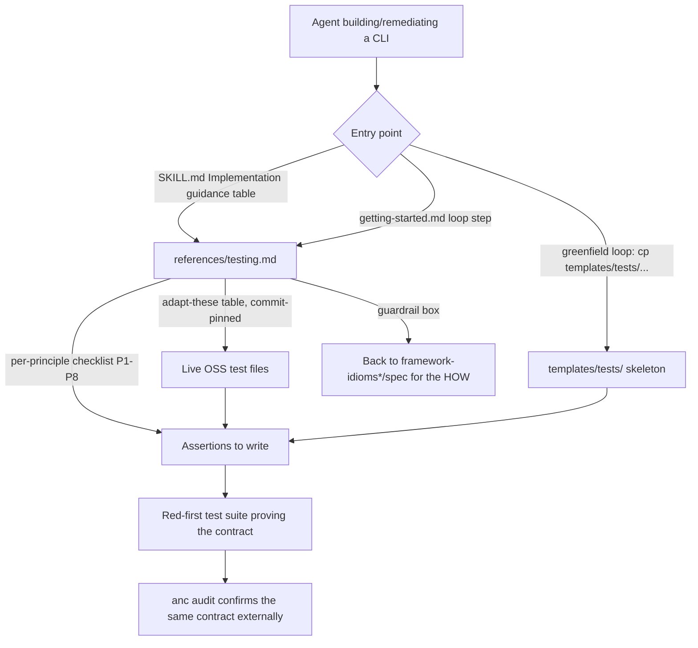

# feat: testing guidance + adaptable OSS test references for the agentnative skill

## Summary

Add a testing layer to the `agent-native-cli` skill bundle so an agent building or remediating an agent-native CLI (or
agent-facing web surface) gets explicit, principle-organized clues about **what to prove** and is pointed at our own
open-source, CI-green test files to **adapt** for its repo. The deliverable is a new `references/testing.md` (a
language-agnostic behavioral-test checklist keyed to P1-P8, a language to test-harness table, an explicit
allowed-vs-forbidden guardrail, and a commit-pinned "adapt these" table annotating our flagship OSS test files), two
small self-contained adaptable skeletons under `templates/tests/`, thin wire-in edits (SKILL.md pointer row,
`getting-started.md` loop steps, de-duplication of the Rust-only testing prose in `references/project-structure.md`),
and a new eval that validates the skill change itself. Hard constraint honored throughout: the bundle hands over
**robust tests and testing guidance, never implementation recipes** — the "how to build the feature" layer already lives
in the existing `framework-idioms*` references, `rust-clap-patterns.md`, `templates/*.rs`, and the spec, and this
feature only adds the "prove the contract" layer.

---

## Problem Frame

The skill teaches an agent how to design, build, and audit an agent-native CLI, and how to run `anc` to score it against
the eight principles. It says almost nothing about how the agent should **test its own tool**:

- The only testing prose is `references/project-structure.md` § "Testing Patterns" (lines 88-116). It is Rust-only,
  implementation-architecture-flavored (wiremock, a `TestEnv` XDG-isolation struct, sequential phases, robust JSON
  output parsing, a pre-flight auth gate), buried inside a Rust project-structure doc, not organized by principle, and
  points at no adaptable files.
- `templates/agents-md-template.md` § Test lists only `cargo test` command invocations — surface plumbing, not a
  behavioral contract to verify.
- The v0.4.0 determinism plan (`docs/plans/2026-05-01-001-feat-skill-determinism-hardening-plan.md`, R11) proposed a
  `templates/cli-tests.rs` starter and a "Testing P5 mutation boundaries" sub-section, and deferred JS/Ruby rows. None
  of those shipped (`git log` shows no `templates/cli-tests*`; CHANGELOG has no testing entry). The gap is real and
  already acknowledged internally.

Meanwhile, `anc` is a black-box auditor: it spawns the target and asserts observable behavior against the spec, but it
does **not** write unit or integration tests for the target's own repo, and it cannot help the agent reach coverage in
its own CI. So there is a genuine, non-duplicative job for the skill: teach the agent to build a test suite that proves
the P1-P8 contract, using our proven OSS tests as the starting material.

We have excellent, battle-tested, CI-green tests to hand over:

- `agentnative-cli` `tests/integration.rs` — black-box `assert_cmd` + `predicates` tests that map almost one-to-one to
  the principles (help/version tokens for P3; `--output json` parses and `--json` alias for P2; NO_COLOR strips ANSI;
  JSON error envelope with `error`/`kind`/`message`/`exit_code`; bare-invocation-prints-help and non-interactivity for
  P1; exit-code 2 on usage errors and stderr `error` for P4; `--` separator, flag-value pairing, completions for P6;
  `--quiet` suppresses PASS/SKIP for P7; a bidirectional stable-top-level-keys schema-contract test for P2).
- `agentnative-cli` `tests/dogfood.rs` — spawns the real binary against its own repo, parses the JSON scorecard, and
  asserts no `fail` on `p2-*`/`p5-*` rows: the "wire the standard's own auditor into your CI" pattern.
- `agentnative-site` `tests/worker.test.ts` — a self-contained content-negotiation + header-policy matrix that exercises
  an agent-facing HTTP handler end-to-end against a stubbed environment (no live server): the strongest template for
  table-driven black-box testing of agent-facing request/response behavior (Accept negotiation, User-Agent allowlist,
  content-types, CORS, cache policy).
- `agentnative-site` `tests/score-contract.test.ts` — cross-validates JSON artifacts and fails CI before shape drift
  ships: a P2 structured-output contract template.

The problem this plan closes: give the agent the "what to assert" checklist plus these adaptable files, without ever
crossing into "here is how to write the feature code."

---

## Requirements

- R1. A single durable testing guide (`references/testing.md`) organized by the eight principles: for each principle,
  the observable behaviors an agent operator can assert (black-box), stated language-agnostically.
- R2. An explicit **allowed-vs-forbidden guardrail** in the guide that draws the line between "here is a robust test to
  adapt" (allowed) and "here is how to code the feature" (forbidden), and points the reader back to the existing
  implementation references and the spec for the "how".
- R3. A curated "adapt these" table that surfaces our flagship OSS test files with **commit-pinned** links, annotated by
  which principle(s) each named test block proves and how to swap in the reader's own tool.
- R4. Language coverage that scales: one language-agnostic principle checklist (single source of truth) plus a language
  to black-box-test-harness table (Rust/clap, Python Click & argparse, Go Cobra, JS Commander/yargs/oclif, Ruby Thor)
  and two concrete worked skeletons — not a full per-language suite.
- R5. Two small, self-contained, adaptable test skeletons in the bundle (`templates/tests/`): one Rust `assert_cmd`
  skeleton and one TS/bun skeleton, principle-organized, each header-attributed to the source repo + path + commit SHA
  it was distilled from, framed as a starting skeleton whose linked live file is authoritative.
- R6. Thin wire-in so agents actually find the guidance: a pointer from SKILL.md (keeping it under 200 lines), loop
  steps in `getting-started.md` (including a `cp templates/tests/...` line in the greenfield loop), and de-duplication
  of the Rust-only testing prose in `references/project-structure.md` (move principle-level content to `testing.md`,
  keep only Rust-specific hermetic-test architecture there with a cross-link).
- R7. A new eval that validates the skill change: a fresh agent must discover the testing guidance through the skill's
  normal activation and the SKILL.md body "Implementation guidance" pointer (the eval prompt must not name the file),
  adapt one of our OSS test files to a toy CLI, and reach per-principle behavioral coverage — without the bundle handing
  it implementation recipes.
- R8. All new/edited consumer-facing markdown passes the repo's markdownlint gate and follows the present-truth,
  no-em-dash, no-plan/KTD-tag-in-shipped-prose conventions; SKILL.md stays under 200 lines.

Traceability: R1/R2/R4 → U1; R3 → U1 (links) + U2 (skeleton headers); R5 → U2; R6 → U3; R7 → U4; R8 → all units +
Verification Contract.

---

## Key Technical Decisions

### KTD1. The guardrail is the black-box / behavioral boundary

Behavioral (black-box) tests assert what an agent operator observes from outside the tool: help text contains a token,
`--output json` parses and carries key X, exit code is 2 on a usage error, `NO_COLOR=1` removes ANSI, a non-TTY
invocation does not hang. These describe **what the tool must do** — the same contract `anc` audits and the spec defines
— and by construction they do not prescribe **how** to make them pass (no flag-wiring, no library calls, no code). The
"how" already lives in `references/framework-idioms.md`, `references/framework-idioms-other-languages.md`,
`references/rust-clap-patterns.md`, `templates/*.rs`, and `spec/principles/`. This feature adds only the "prove it"
layer and explicitly links back to those for implementation. Rationale: this is the natural, defensible line that
satisfies the user's hard constraint ("do not tell them how to implement; you can give robust tests") without inventing
an artificial rule — a behavioral assertion is a robust test, not an implementation recipe. The guide states this
boundary in a short call-out box (R2) and every reviewer criterion enforces it.

### KTD2. Reference-first, minimal-vendor mechanism (link the live files, ship two small skeletons)

Surface our OSS tests two ways, weighted toward the non-drifting one:

1. **Primary — commit-pinned links** to the live flagship files (`agentnative-cli` `tests/integration.rs`,
   `agentnative-site` `tests/worker.test.ts`, plus `tests/dogfood.rs` and `tests/score-contract.test.ts` as secondary
   references). These stay green because the source repos run them in CI on every PR, so the reference is always a real,
   working example. Pin to an immutable commit SHA (consistent with this org's supply-chain pinning culture — pin to a
   SHA, not a branch), with a trailing note naming the file's role so a moved/renamed file is still findable.
2. **Secondary — two small vendored skeletons** under `templates/tests/` (KTD3) so the bundle is useful offline and the
   agent has a `cp` target, accepting that a vendored copy is a point-in-time snapshot.

Rejected: **vendoring the full files** (high drift — a full copy has no resync script and no CI keeping it valid against
its home repo, and the repo's culture is explicitly anti-drift; also large). Rejected: **link-only, no in-bundle
artifact** (the user explicitly wants robust tests handed over, and the bundle should be useful without network access).
Rejected: **full per-language suites** (drift + maintenance; the checklist + harness table + two anchors cover the long
tail — YAGNI). Constraint noted in Risks: CI here runs markdownlint + shellcheck only, with **no link-checker**, so
pinned links are not gate-verified — they are verified manually at authoring time and carry a documented re-verify step.

### KTD3. Language handling: one agnostic checklist + harness table + two anchors

The P1-P8 contract is observable and language-independent, so the principle checklist (R1) is written once,
language-agnostically (STAR/DRY — single source of truth), mirroring how `framework-idioms-other-languages.md` states a
principle then gives per-language notes. Concrete anchoring comes from a language to test-harness table (Rust
`assert_cmd`+`predicates`; Python `subprocess`+`pytest` or Click's `CliRunner`; Go `os/exec`+`testing`; Node `execa` or
`node:test`/`vitest`; Ruby `open3`+`minitest`/`rspec`) and two worked skeletons (Rust + TS/bun) that the other
ecosystems adapt. This subsumes the deferred JS/Ruby rows from the v0.4.0 plan without committing to five full suites.

### KTD4. Placement: a new reference is the home; SKILL.md gets only a pointer

The checklist, guardrail, and adapt-these table live in `references/testing.md` (R1), not in SKILL.md — SKILL.md is
orientation and is at 195/200 lines, so it receives only a one-row addition to its existing "Implementation guidance"
table plus, if it fits under 200, a single "prove it" sentence. `getting-started.md` gets loop steps. The Rust-only
testing prose in `references/project-structure.md` is de-duplicated against `testing.md` (KTD moves principle-level
content out, leaves Rust hermetic-test architecture in place with a cross-link) so there is exactly one home for the
language-agnostic material (present-truth + DRY).

### KTD5. Validate the skill change with an eval, not a unit test

The bundle ships markdown and template files; there is no runtime to unit-test. The skill change is validated the way
the bundle validates its other guidance: a self-contained eval (`evals/04-*.md`) dispatched to a fresh agent that must
discover the testing guidance through the skill's normal activation and the SKILL.md body "Implementation guidance"
pointer (the eval prompt must not name the file), adapt one of our OSS test files to a toy CLI, and reach per-principle
behavioral coverage — with an "Anti-patterns to detect" section that fails the run if the agent was handed (or wrote
from the bundle) implementation recipes rather than tests. Mechanical validation (markdownlint, skeleton syntax, link
resolution) is the Verification Contract.

---

## High-Level Technical Design

### Artifact map and the allowed/forbidden boundary

| Layer             | Question it answers                    | Where it lives (this feature vs existing)                         | Allowed to prescribe implementation?  |
| ----------------- | -------------------------------------- | ----------------------------------------------------------------- | ------------------------------------- |
| Contract          | What must the tool do?                 | `spec/principles/` (existing) + `anc` audit                       | n/a (defines the contract)            |
| Prove-it (NEW)    | How do I assert the tool does it?      | `references/testing.md`, `templates/tests/`                       | No — black-box assertions only (KTD1) |
| How-to (existing) | How do I build the tool to satisfy it? | `framework-idioms*.md`, `rust-clap-patterns.md`, `templates/*.rs` | Yes (existing references own this)    |

The new layer sits between the contract and the how-to and only ever points **down** to the how-to references for
implementation — it never restates them.

### Guidance discovery flow (how an agent reaches the testing layer)



### Per-principle checklist shape (content sketch, directional — not the final prose)

For each principle the guide states the observable assertions, e.g.:

- P1 (non-interactive): a verb run with stdin closed neither hangs nor prompts; required inputs error instead of
  prompting; env-var configuration is honored.
- P2 (structured output): `--output json` parses; a stable top-level key set is present (bidirectional check); `--json`
  alias behaves identically; errors under JSON mode emit a typed envelope; NO_COLOR/`--output json` strips ANSI.
- P3 (progressive help): `--help` and `<verb> --help` succeed and contain usage/examples; `--version` prints
  name+version.
- P4 (fail-fast errors): distinct exit codes per failure class (assert each arm, per the "test every exit-code mapping"
  best practice); stderr carries an actionable message; bad flags exit non-zero.
- P5 (safe retries): `--dry-run` previews without mutating; mutations require a confirmation flag in non-TTY.
- P6 (composable): `--` separator; pipe-safety / no SIGPIPE panic; completions generate; stdout/stderr separation.
- P7 (bounded responses): `--quiet` suppresses non-essential lines; `--limit`/pagination clamps output.
- P8 (discoverable bundle): the advertised skill-install/bundle surface exists and is greppable from help.

Each item is an assertion intent (input, action, expected observable), pointing at the OSS test block that demonstrates
it. No item tells the reader how to implement the underlying behavior.

---

## Output Structure

```text
references/
  testing.md            # NEW — the durable testing guide (R1-R4)
templates/
  tests/                # NEW dir (R5)
    README.md           # what these are, how to adapt, source SHAs, "live file is authoritative"
    cli-integration.rs  # Rust assert_cmd skeleton distilled from agentnative-cli tests/integration.rs
    worker.test.ts      # TS/bun skeleton distilled from agentnative-site tests/worker.test.ts
evals/
  04-prove-the-contract.md   # NEW — eval that validates the skill change (R7)
```

Existing files edited: `SKILL.md`, `getting-started.md`, `references/project-structure.md`, `evals/README.md`,
`CHANGELOG.md` is generated (not hand-edited). The tree is a scope declaration; the per-unit `**Files:**` lists are
authoritative.

---

## Implementation Units

### U1. Author `references/testing.md` — the durable testing guide

**Goal:** Create the single home for the per-principle behavioral-test checklist, the allowed/forbidden guardrail, the
language to test-harness table, and the commit-pinned "adapt these" table.

**Requirements:** R1, R2, R3, R4, R8.

**Dependencies:** none (U2 skeletons are referenced by this doc but can be authored in parallel; final cross-links land
after U2).

**Files:**

- `references/testing.md` (create)

**Approach:**

1. Open with a one-paragraph framing: these are black-box/behavioral tests that assert the observable P1-P8 contract;
   the same contract `anc` audits, expressed as tests you own in your repo so you reach coverage.
2. Add the **guardrail call-out box** (KTD1, KTD2): allowed = adapt these robust tests / assert observable behavior;
   forbidden = restating implementation. One line pointing the "how" question at `framework-idioms.md`,
   `framework-idioms-other-languages.md`, `rust-clap-patterns.md`, `templates/*.rs`, and `spec/principles/`.
3. Write the **per-principle checklist** (P1-P8) as assertion intents (input/action/expected observable), language
   agnostic, following the HTD content sketch. Cite the spec principle file per section; do not paraphrase the principle
   text (respect the existing "do not paraphrase the principles" rule in SKILL.md).
4. Add the **language to test-harness table** (KTD3): Rust `assert_cmd`+`predicates`; Python `subprocess`+`pytest` /
   Click `CliRunner`; Go `os/exec`+`testing`; Node `execa` / `node:test` / `vitest`; Ruby `open3`+`minitest`/`rspec`.
   Add one orienting line so a JS/Ruby/Python/Go CLI author who has no CLI-shaped example in their own language knows to
   map the Rust `assert_cmd` anchor's structure onto their harness-table row, and to read the TS/bun anchor as the
   web-surface pattern (not a CLI pattern).
5. Add the **"adapt these" table** (R3) with commit-pinned raw/permalink URLs and per-block annotations:
   - `agentnative-cli` `tests/integration.rs` @ `013a527b241ad2ed318963cec1ebf838f16f60fa` — maps blocks to
     P1/P2/P3/P4/P6/P7 and the schema-contract test.
   - `agentnative-cli` `tests/dogfood.rs` (same repo) — "run the standard's auditor against yourself in CI".
   - `agentnative-site` `tests/worker.test.ts` @ `78fea0df3ee00579f84abfde6e249eeea8ad3ffe` — agent-facing HTTP behavior
     matrix (P2/P3-analog for web surfaces).
   - `agentnative-site` `tests/score-contract.test.ts` (same repo) — P2 structured-output contract/drift test. Each row
     says which principle(s) the block proves and "swap the binary name + expected tokens for your tool".
6. Add a short footer: the source SHAs above are snapshots; re-verify links when adapting (no automated link-check in CI
   — see Risks), and the live file at HEAD is the authoritative robust version.
7. Reference the "test every exit-code mapping" best practice in the P4 section as guidance (state the principle; do not
   link the `docs/solutions/` path — it is a separate private repo and not shippable in the public bundle).

**Patterns to follow:** the per-principle, per-topic structure and tone of
`references/framework-idioms-other-languages.md`; the table + prose mix already used in SKILL.md; the "do not paraphrase
the principles" discipline.

**Execution note:** consumer-facing markdown — write present-truth, no em-dashes, no `Plan U#`/`KTD-#`/`(R#)` tags in
the shipped prose (those identifiers stay in this plan only).

**Test scenarios:**

- Markdownlint (`markdownlint-cli2`) passes on the new file (MD013 120-char prose lines, ATX headings, dash bullets).
- Every commit-pinned URL resolves to the named file at the named SHA (manual fetch returns 200 and the file contains
  the cited test names, since CI has no link-checker).
- Every principle P1-P8 has at least one assertion-intent item, and each item names an input, action, and expected
  observable (no bare "test P4").
- The guardrail box is present and names both the allowed and forbidden side and the "how" back-references.
- Grep the file: no em-dash `—`; no `Plan`/`KTD-`/`(R` shipped-prose tags; no `docs/solutions/` path.
- Cross-check: each "adapt these" annotation matches an actual `describe`/`#[test]` block that exists in the linked file
  at the pinned SHA (no invented block names).

### U2. Ship two adaptable skeletons under `templates/tests/`

**Goal:** Provide small, self-contained, principle-organized black-box test skeletons the agent can `cp` and adapt
offline — the in-bundle "robust tests" artifact.

**Requirements:** R5, R3 (source attribution), R8.

**Dependencies:** none (parallel with U1; U1's adapt-these table links to these once both exist).

**Files:**

- `templates/tests/README.md` (create)
- `templates/tests/cli-integration.rs` (create)
- `templates/tests/worker.test.ts` (create)

**Approach:**

1. `cli-integration.rs`: distill the representative, principle-mapped subset of `agentnative-cli` `tests/integration.rs`
   (help/version tokens; `--output json` parses + stable-key set; `--json` alias; NO_COLOR strips ANSI; JSON error
   envelope; bare-invocation help / non-interactivity; exit-code-2 usage error; `--` separator; `--quiet` suppression).
   Replace `anc`-specific expectations with clearly-marked placeholders (`YOUR_BINARY`, `YOUR_EXPECTED_TOKEN`) so it is
   a skeleton, not a copy. Keep it small (a representative slice, not the whole 1371-line file).
2. `worker.test.ts`: distill the content-negotiation + header-policy core of `agentnative-site` `tests/worker.test.ts`
   (the `detectPreference` Accept/UA matrix and the `applyHeaders` content-type/CORS/cache assertions) against a stubbed
   env, with placeholders for the reader's routes/tokens. Small representative slice.
3. Each file: a header comment recording source repo + repo-relative path + the commit SHA it was distilled from, one
   line stating "the live file is the authoritative robust version; this is a starting skeleton to adapt", and per-block
   comments naming which principle the block proves.
4. `templates/tests/README.md`: what these are, how to adapt (swap placeholders, run red-first), the source SHAs, the
   language to test-harness table pointer back to `references/testing.md`, and the "these are snapshots" note.

**Patterns to follow:** the existing `templates/*.rs` convention (drop-in starter files referenced from
`getting-started.md` via `cp`); the header/comment style is comment-policy-compliant (WHY/context only, allowed
doc-comment surface).

**Execution note:** keep the skeletons syntactically valid in their language so an adapter starts from a
compiling/parsing base; do not include feature implementation — assertions and stubbed harness only (KTD1).

**Test scenarios:**

- `cli-integration.rs` parses as valid Rust (e.g., `rustfmt --check` or a throwaway `cargo` crate that includes it
  compiles the test module, with placeholders resolved to a trivial echo binary) — at minimum it is `rustfmt`-clean.
- `worker.test.ts` parses as valid TypeScript (a throwaway `bun`/`tsc` parse of the file succeeds with placeholders
  stubbed).
- Both files carry a header naming source repo + path + SHA and the "live file is authoritative" line.
- Every test block has a comment naming the principle it proves.
- Grep: no em-dash in comments; no real secret/private identifier; no `anc`-only hardcoded expectations left
  un-placeholdered.
- `templates/tests/README.md` passes markdownlint and its SHAs match the header SHAs in the two skeletons.

### U3. Wire the guidance into the discovery path (thin edits)

**Goal:** Make agents actually reach `references/testing.md` and the skeletons, and remove the duplicate testing prose.

**Requirements:** R6, R8.

**Dependencies:** U1, U2 (link targets must exist).

**Files:**

- `SKILL.md` (modify — add one row to the "Implementation guidance" table pointing at `references/testing.md`; add at
  most one "prove it" sentence only if the file stays under 200 lines)
- `getting-started.md` (modify — add a "Prove the contract" step to each of the three loops; add `cp
  <skill-root>/templates/tests/cli-integration.rs tests/` to the greenfield Rust loop; add a "Where things live" row)
- `references/project-structure.md` (modify — trim § "Testing Patterns" to Rust-specific hermetic-test architecture only
  (wiremock, `TestEnv`/XDG isolation, sequential phases), replace the language-agnostic bits with a cross-link to
  `references/testing.md`)

**Approach:**

1. SKILL.md: add a row to the table under "## Implementation guidance (when fixing findings)": `| How do I prove a
   principle with tests? | references/testing.md |`. Verify `wc -l SKILL.md` stays < 200; if the row plus any sentence
   would exceed 200, drop the sentence and keep only the row.
2. getting-started.md: in "You have an existing CLI", "You're building from scratch (Rust)", and "You're building in
   another language", add a short step pointing at `references/testing.md` and (greenfield only) the `cp` line for the
   Rust skeleton. Add a "Where things live" row: "How do I test my CLI against the principles? → references/testing.md".
3. project-structure.md: keep the Rust-only architecture (wiremock/TestEnv/XDG/pre-flight auth) as Rust specifics; move
   "Robust output parsing" (parse JSON, assert fields — a language-agnostic principle) into `testing.md` if not already
   there, and replace with a one-line cross-link so the material lives once (DRY/present-truth).

**Patterns to follow:** existing SKILL.md table rows and getting-started.md loop/`cp` structure.

**Execution note:** SKILL.md is at 195 lines — treat "< 200 lines" as a hard gate on this unit.

**Test scenarios:**

- `wc -l SKILL.md` reports < 200 after the edit.
- SKILL.md and getting-started.md render a working relative link to `references/testing.md` (target exists after U1).
- getting-started.md greenfield loop references a `templates/tests/` file that exists after U2.
- `references/project-structure.md` no longer duplicates the language-agnostic testing checklist (grep confirms the
  principle-level content appears only in `testing.md`); the Rust hermetic-test architecture remains and cross-links.
- markdownlint passes on all three edited files; no em-dash introduced.

### U4. Add an eval that validates the skill change

**Goal:** Prove the guidance is discoverable and that adapting our OSS tests to a fresh CLI works without the bundle
leaking implementation recipes.

**Requirements:** R7.

**Dependencies:** U1, U2, U3 (the eval exercises the shipped guidance).

**Files:**

- `evals/04-prove-the-contract.md` (create)
- `evals/README.md` (modify — add a table row and follow the existing eval conventions)

**Approach:**

1. Follow the eval conventions in `evals/README.md`: self-contained, never names the skill or the testing reference
   file, workdir-first (`/tmp/eval-prove-the-contract-$(date +%s)/`), required artifacts, 5-8 numbered success criteria
   scored 0-10, "Anti-patterns to detect", an escalation rule, and a "What done looks like".
2. Task: the agent is given (or builds) a tiny CLI and must produce a black-box test suite proving at least P1-P4 + P6
   observable behaviors, by discovering the testing guidance and adapting one of our OSS test files.
3. Success criteria include: discovered `references/testing.md` via the skill's normal activation and the SKILL.md body
   "Implementation guidance" pointer (the eval prompt does not name the file); adapted a named OSS test block (cited by
   principle); wrote assertions for JSON shape, exit codes, NO_COLOR, non-interactivity; ran the suite red then green.
4. Anti-patterns to detect (enforce the guardrail): the agent copied an implementation recipe instead of a test; the
   agent wrote tests that assert internal implementation details rather than observable behavior; the agent invented
   coverage the guide already provides instead of adapting our files.

**Patterns to follow:** `evals/01-greenfield-rust-cli.md` and `evals/03-multilang-python-cli.md` structure verbatim
(sections, scoring, escalation order).

**Test scenarios:**

- The eval file has all seven convention sections from `evals/README.md` (self-contained, workdir-first, required
  artifacts, numbered success criteria 5-8, document-dead-ends, regression-tests-prior-findings, forces-one-escalation).
- Dry-run dispatch to a fresh agent (manual, at review time) shows the agent reaches `references/testing.md` from the
  description and adapts a named OSS block — recorded as the eval's own acceptance.
- `evals/README.md` table lists the new eval with an accurate "what it exercises" cell.
- markdownlint passes; no em-dash.

### U5. Record the vendored-snapshot + re-pin policy (maintenance hygiene)

**Goal:** Make the snapshot/link maintenance contract explicit so the skeletons and pins do not silently rot, and note
the cross-feature re-pin trigger.

**Requirements:** R3, R5 (drift management), R8.

**Dependencies:** U1, U2.

**Files:**

- `CONTRIBUTING.md` (modify — add a short "Testing references and skeletons" note: skeletons and pinned links are
  point-in-time snapshots of the source repos' CI-green files; re-derive/re-pin when the source test files change
  materially; CI has no link-checker so verify manually)
- `references/testing.md` (modify — ensure the footer note from U1 states the same policy; no duplication of the full
  policy, just the one-line reader-facing version)

**Approach:** state the policy once in CONTRIBUTING (maintainer-facing) and keep only the one-line reader-facing note in
`testing.md`. Call out the specific cross-feature trigger: `agentnative-site` `tests/worker.test.ts` is the artifact of
the content-negotiation feature that a sibling site plan is extending; if that behavior changes, re-pin the SHA and
re-derive the TS skeleton.

**Patterns to follow:** existing CONTRIBUTING.md section style.

**Execution note:** this is documentation of a maintenance contract, not code; keep it to a short subsection.

**Test scenarios:**

- `CONTRIBUTING.md` gains a "Testing references and skeletons" subsection naming the snapshot + re-pin +
  manual-link-verify policy and the cross-feature trigger; markdownlint passes.
- No duplication: the full policy lives in CONTRIBUTING, the one-liner in `testing.md`.
- Grep: no em-dash; consumer-facing CONTRIBUTING follows present-truth (no temporal narration).

---

## Scope Boundaries

In scope: the testing guide, two adaptable skeletons, thin wire-in, one eval, and the maintenance note. Everything is
additive documentation/template content in the `agentnative-skill` bundle.

### Deferred to Follow-Up Work

- Full per-language test suites (Python/Go/Ruby beyond the checklist + harness row + adapted skeletons) — YAGNI until an
  ecosystem-specific request appears.
- An automated resync script for the vendored skeletons (mirroring `scripts/sync-spec.sh`) or a CI link-checker
  (`lychee`) to gate the pinned links — proposed as an option in Open Questions, not built here.
- A `templates/tests/` skeleton for Go/Python/Ruby harnesses.
- Any change to `anc` or the spec (out of this repo).

### Not in scope (non-goals)

- Adding implementation recipes of any kind (the entire point is to not do this — KTD1).
- Restating principle text in the testing guide (SKILL.md's "do not paraphrase the principles" rule stands).
- Editing the source test files in `agentnative-cli` / `agentnative-site`.

---

## Risks & Dependencies

- **Link rot / no CI link-check (medium).** CI here runs only markdownlint + shellcheck; pinned links are not
  gate-verified. Mitigation: pin to immutable SHAs, name each file's role, verify manually at authoring time, and the
  offline skeletons (U2) cover the network-unavailable path. Follow-up option: add a `lychee` link job (Open Questions).
- **Skeleton drift (medium).** Vendored skeletons are snapshots; the live files evolve. Mitigation: keep skeletons small
  and representative, header-attribute the source SHA, state "live file is authoritative", and record the re-pin policy
  (U5). Kept minimal deliberately to bound the drift surface.
- **Cross-feature re-pin (low, tracked).** `agentnative-site` `tests/worker.test.ts` is the artifact of the site
  content-negotiation feature a sibling plan extends; a change there invalidates the pinned SHA and the TS skeleton.
  Mitigation: pin to the current SHA now, re-pin after the sibling feature lands (U5 note + Open Questions).
- **SKILL.md 200-line ceiling (low).** SKILL.md is at 195 lines; U3 must stay under 200 (hard gate on that unit).
- **Guardrail slippage (low).** An implementer could drift into implementation prose. Mitigation: the guardrail box, the
  reviewer criteria in every unit, and the eval's anti-patterns all enforce KTD1.

---

## Assumptions

- Headless run per the orchestrator's explicit "run autonomously, never block" directive; the scoping-confirmation gate
  is treated as auto-proceed and best-judgment calls are recorded here rather than asked.
- `OUTPUT_FORMAT=md`; `docs_root` defaults to `docs` (no `.compound-engineering/config`); plan path and sequence
  (`2026-08-03-001`) as given.
- The `agentnative-cli` and `agentnative-site` repos are MIT (site) and MIT/Apache-2.0 (cli), so distilling small
  attributed skeletons and linking their test files into the MIT skill bundle is license-compatible.
- The current SHAs recorded (cli `tests/integration.rs` @ `013a527b…`, site `tests/worker.test.ts` @ `78fea0df…`) are
  valid pin candidates at authoring time; implementer re-checks HEAD before pinning if time has passed.
- Two ecosystems (Rust, TS/bun) are the right concrete anchors because they are the two with flagship files we own;
  other languages are served by the checklist + harness table.

---

## Open Questions

- **Pin timing vs the sibling site feature.** Pin `worker.test.ts` to the current SHA now and re-pin after the site
  content-negotiation feature lands, or wait? Best-judgment default: pin now, note the re-pin trigger (U5). A reviewer
  who knows the sibling feature's timeline may override.
- **Add a `lychee` CI link-check?** Would gate the pinned links against rot but adds a CI job and a network dependency
  in CI. Deferred by default (Scope Boundaries); flag for a maintainer decision.
- **Skeleton language pair.** Rust + TS/bun chosen as anchors. Is a Python (`pytest`+`subprocess`) skeleton worth adding
  as a third anchor given Python is a first-class language in the skill? Default: no (checklist + harness row covers
  it); revisit if the eval shows Python adapters struggle.
- **Attribution vs `docs/solutions/`.** The "test every exit-code mapping" guidance is referenced by principle only (the
  solutions file is a separate private repo). Confirm no other private-repo path leaks into shipped prose.

---

## Verification Contract

- `markdownlint-cli2` passes on all new/edited markdown (the repo's CI gate).
- `wc -l SKILL.md` < 200.
- Both skeletons are syntactically valid (`rustfmt --check` on the Rust skeleton; a `bun`/`tsc` parse on the TS skeleton
  with placeholders stubbed).
- Every commit-pinned link resolves to the named file at the named SHA and the cited block names exist there.
- Grep gates: no em-dash `—` in any new/edited file; no `Plan`/`KTD-`/`(R#)` shipped-prose tags; no `docs/solutions/` or
  other private-repo path in shipped prose.
- Guardrail backstop (heuristic, deterministic): every fenced code block in `references/testing.md` reads as a
  test/assertion harness rather than feature code, i.e. it contains a recognized assertion or test token (`assert`,
  `expect`, `#[test]`, `describe(`, `it(`, `predicates`) or is a shell/command invocation example, and declares no bare
  handler/function bodies without assertions. This is a cheap greppable backstop to the eval's judgment scoring of the
  allowed/forbidden guardrail (KTD1); the eval remains the authoritative check.
- The eval file carries all seven `evals/README.md` convention sections and an "Anti-patterns to detect" section that
  encodes the guardrail.
- Present-truth: no temporal/historical narration in the shipped docs.

## Definition of Done

`references/testing.md` and `templates/tests/{README.md,cli-integration.rs,worker.test.ts}` exist and pass the
Verification Contract; SKILL.md, getting-started.md, and references/project-structure.md route agents to the testing
layer with no duplicated language-agnostic testing prose and SKILL.md under 200 lines; `evals/04-prove-the-contract.md`
plus its README row exist and encode the guardrail as anti-patterns; CONTRIBUTING records the
snapshot/re-pin/manual-link policy; and a manual read confirms the bundle hands over robust tests and testing guidance
without a single implementation recipe (KTD1).

---

## Sources & Research

- `SKILL.md`, `getting-started.md`, `references/project-structure.md` (§ Testing Patterns),
  `references/framework-idioms-other-languages.md`, `templates/agents-md-template.md`, `evals/README.md`,
  `evals/01-greenfield-rust-cli.md`, `evals/03-multilang-python-cli.md` (current skill structure and conventions).
- `docs/plans/2026-05-01-001-feat-skill-determinism-hardening-plan.md` (R11 proposed-but-unshipped
  `templates/cli-tests.rs` and "Testing P5 mutation boundaries"; deferred JS/Ruby rows).
- `.context/compound-engineering/todos/2026-05-04-002-skill-vs-anc-razor.md` (the skill vs `anc` boundary that justifies
  putting testing guidance in the skill without duplicating what `anc`/the spec surface).
- `agentnative-cli` `tests/integration.rs`, `tests/dogfood.rs`, `tests/standard_names_integration.rs` (flagship
  black-box CLI tests mapped to principles; the "audit yourself in CI" pattern).
- `agentnative-site` `tests/worker.test.ts`, `tests/score-contract.test.ts` (agent-facing HTTP behavior matrix; JSON
  contract/drift test).
- `docs/solutions/best-practices/test-exit-code-paths-even-if-trivial-2026-04-20.md` (test-every-exit-code-mapping
  guidance; referenced by principle only — private repo, not linked in shipped prose).
